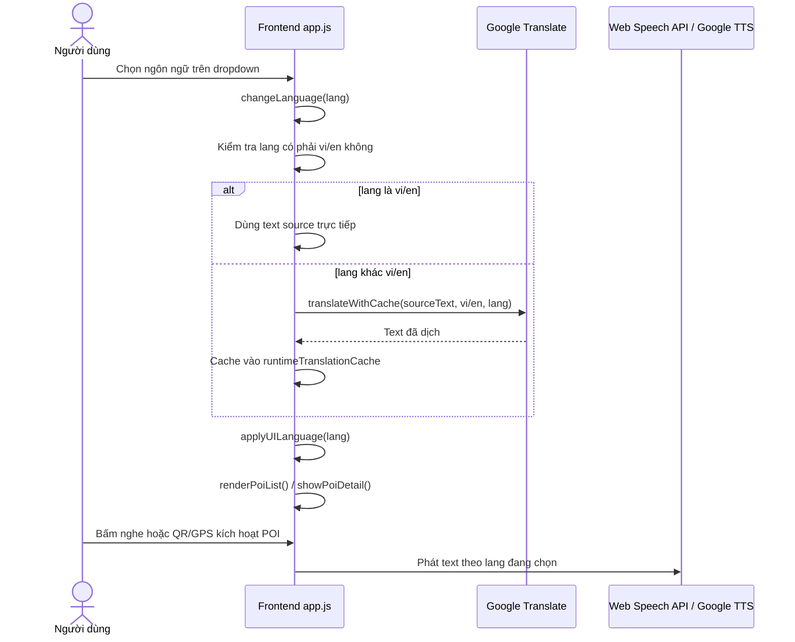

# Hướng Dẫn Giải Thích Demo & Bảo Vệ Chức Năng Đa Ngôn Ngữ

Tài liệu này dùng để trả lời khi giảng viên nhìn vào sequence diagram, hỏi luồng chạy, hỏi method nằm ở đâu, hoặc hỏi cách app dịch giao diện / dịch nội dung / phát audio.

---

## 1. Ý tưởng chính cần nói trước

Ứng dụng không bắt Admin nhập đủ 20 ngôn ngữ. Admin chỉ cần nhập **tiếng Việt (`vi`) hoặc tiếng Anh (`en`)**. Đây là **ngôn ngữ nguồn**.

Khi du khách chọn ngôn ngữ khác như Nhật (`ja`), Hàn (`ko`), Thụy Điển (`sv`), Ba Lan (`pl`)…, Frontend sẽ:

1. Kiểm tra ngôn ngữ đang chọn có phải `vi/en` không.
2. Nếu là `vi/en` thì dùng trực tiếp dữ liệu có sẵn.
3. Nếu không phải `vi/en`, app lấy source ưu tiên `vi`, thiếu `vi` thì lấy `en`.
4. Gọi Google Translate endpoint client-side để dịch.
5. Cache kết quả trong RAM trình duyệt để đổi lại nhanh hơn.
6. Render lại giao diện, danh sách POI, chi tiết POI.
7. Khi phát audio, Web Speech API đọc text đã dịch; nếu máy không có voice thì fallback Google Translate TTS.

Câu trả lời ngắn gọn:

> Hệ thống dùng `vi/en` làm source language. Các ngôn ngữ còn lại được dịch runtime ở Frontend bằng Google Translate, cache lại trong trình duyệt, rồi đưa text đã dịch vào Web Speech API hoặc Google TTS fallback để phát audio.

---

## 2. Giảng viên hỏi: “Sequence đổi ngôn ngữ chạy như thế nào?”

Chỉ vào PRD mục **9.2 Luồng Đổi Ngôn Ngữ, Dịch Runtime và Phát Thuyết Minh**.

File PRD:

```text
PRD_VinhKhanh_Final2.md
```

Luồng giải thích:



Câu trả lời:

> Khi user đổi dropdown, hàm `changeLanguage(lang)` chạy. Hàm này set `AppState.language`, gọi dịch các text cần thiết nếu không phải `vi/en`, sau đó gọi `applyUILanguage()` để đổi label giao diện, `renderPoiList()` để đổi danh sách, `showPoiDetail()` nếu bottom sheet đang mở, và cập nhật ngôn ngữ cho `audioManager`.

---

## 3. Giảng viên hỏi: “Code đổi ngôn ngữ nằm ở đâu?”

File chính:

```text
CShape/VinhKhanhFoodTour.Api/wwwroot/js/app.js
```

Các method quan trọng:

| Method | Vai trò |
|---|---|
| `changeLanguage(lang)` | Entry point khi user đổi dropdown ngôn ngữ. |
| `applyUILanguage(lang)` | Đổi toàn bộ label giao diện: GPS, nút nghe, QR modal, AAC modal, offline banner. |
| `isSourceLanguage(lang)` | Kiểm tra ngôn ngữ có phải source `vi/en` không. |
| `getSourceLanguage(textMap)` | Chọn source ưu tiên `vi`, nếu thiếu thì `en`. |
| `translateWithCache(scope, id, text, from, to)` | Gọi dịch và cache kết quả. |
| `getLocalizedPoiText(poi, field, lang)` | Lấy/dịch tên POI, mô tả POI, script audio. |
| `getPoiScript(poi, lang)` | Lấy/dịch script thuyết minh để phát audio. |
| `setBtnText(btnId, text)` | Sửa bug button bị nhân đôi text khi đổi ngôn ngữ. |
| `showAppMessage(title, message)` | Hiển thị toast lỗi/thông báo thân thiện thay cho `alert()`. |

Câu trả lời:

> Code đổi ngôn ngữ nằm chủ yếu trong `app.js`. Method chính là `changeLanguage()`. Từ đó app gọi `applyUILanguage()` để đổi label UI và gọi các helper như `translateWithCache()` / `getLocalizedPoiText()` để dịch POI hoặc script thuyết minh.

---

## 4. Giảng viên hỏi: “Dịch giao diện như thế nào?”

Giao diện có các label như:

- GPS đang hoạt động.
- Nghe thuyết minh.
- Chỉ đường.
- Đóng.
- Quét QR Code.
- Nói giúp tôi.
- Offline banner.
- Câu mẫu AAC.

Các label gốc được khai báo trong object:

```js
const UI_TEXT = {
  vi: { ... },
  en: { ... },
  ...
}
```

Nhưng logic mới chỉ xem `vi` và `en` là source chính:

```js
const SOURCE_LANGUAGES = ['vi', 'en'];
const UI_SOURCE_TEXT = {
  vi: UI_TEXT.vi,
  en: UI_TEXT.en
};
```

Luồng dịch UI:

1. User chọn ngôn ngữ, ví dụ `ja`.
2. `changeLanguage('ja')` chạy.
3. `applyUILanguage('ja')` lấy danh sách key cần đổi.
4. Mỗi key gọi `getUiText(key, lang)`.
5. Nếu `lang` là `vi/en`, lấy trực tiếp.
6. Nếu `lang` khác `vi/en`, gọi `translateWithCache()`.
7. Text đã dịch được set vào DOM bằng `textContent`, `title`, `placeholder`.

Câu trả lời:

> Giao diện dịch bằng `applyUILanguage()`. Method này gom các key giao diện, gọi `getUiText()` cho từng key. Nếu là `vi/en` thì dùng trực tiếp, nếu là ngôn ngữ khác thì dịch runtime qua `translateWithCache()`, sau đó update DOM bằng `textContent`, `title`, `placeholder`.

---

## 5. Giảng viên hỏi: “Dịch nội dung POI như thế nào?”

POI có các field đa ngôn ngữ:

```js
poi.name
poi.description
poi.ttsScript
```

Nhưng Admin chỉ cần nhập:

```js
name.vi hoặc name.en
description.vi hoặc description.en
ttsScript.vi hoặc ttsScript.en
```

Method xử lý:

```js
getLocalizedPoiText(poi, field, lang)
```

Ví dụ:

```js
await getLocalizedPoiText(poi, 'name', 'ja')
await getLocalizedPoiText(poi, 'description', 'ko')
```

Luồng:

1. Kiểm tra field `name/description/ttsScript` có source `vi` không.
2. Nếu không có `vi`, dùng `en`.
3. Nếu target là `vi/en`, trả trực tiếp.
4. Nếu target là ngôn ngữ khác, gọi Google Translate.
5. Cache lại vào runtime cache và gán vào object POI trong RAM.

Câu trả lời:

> Nội dung POI dịch bằng `getLocalizedPoiText()`. Hàm này nhận `poi`, field cần dịch và ngôn ngữ đích. Nó chọn source `vi` hoặc `en`, dịch nếu cần, cache kết quả, rồi render ra danh sách hoặc chi tiết POI.

---

## 6. Giảng viên hỏi: “Phát audio theo ngôn ngữ như thế nào?”

Có 2 file cần chỉ:

```text
CShape/VinhKhanhFoodTour.Api/wwwroot/js/app.js
CShape/VinhKhanhFoodTour.Api/wwwroot/js/audio-manager.js
```

Trong `app.js`:

```js
getPoiScript(poi, lang)
```

Hàm này lấy script thuyết minh:

- Nếu `lang` là `vi/en`, dùng script có sẵn.
- Nếu `lang` khác `vi/en`, dịch từ source `vi/en`.
- Cache kết quả.
- Trả text cuối cùng cho audio.

Sau đó gọi:

```js
audioManager.playDirect(poi.id, script, name)
audioManager.enqueue(poi.id, script, name, poi.priority)
```

Trong `audio-manager.js`:

| Method | Vai trò |
|---|---|
| `setLanguage(lang)` | Lưu ngôn ngữ audio hiện tại. |
| `_speak(text, lang)` | Chọn Web Speech hay Google TTS fallback. |
| `_speakWithWebSpeech(text, lang, voice)` | Dùng `SpeechSynthesisUtterance`. |
| `_speakWithGoogleTTS(text, lang)` | Dùng Google Translate TTS nếu thiếu voice. |

Câu trả lời:

> Text audio được chuẩn bị ở `getPoiScript()`. Sau đó `audioManager` phát text đó. Nếu browser có voice phù hợp thì dùng Web Speech API, còn nếu không có hoặc không ổn định thì fallback sang Google Translate TTS.

---

## 7. Giảng viên hỏi: “Tại sao tiếng SV/SE không phát được và đã xử lý sao?”

`SV` là mã app dùng cho tiếng Thụy Điển, thực tế BCP-47 là:

```text
sv-SE
```

Vấn đề:

- Một số trình duyệt/Windows không có Swedish voice.
- Có trường hợp browser báo có voice nhưng phát không ổn định.
- Nếu chỉ dựa Web Speech API thì `sv` có thể im lặng.

Code xử lý trong:

```text
CShape/VinhKhanhFoodTour.Api/wwwroot/js/audio-manager.js
```

Mapping:

```js
'sv': 'sv-SE'
```

Và app ưu tiên Google TTS fallback cho `sv`:

```js
this.preferGoogleTts = new Set(['sv']);
```

Câu trả lời:

> Tiếng Thụy Điển dùng mã `sv-SE`. Do Web Speech API phụ thuộc voice cài trên máy, máy demo có thể không có Swedish voice. Vì vậy em cấu hình `sv` ưu tiên Google Translate TTS fallback để demo vẫn phát được.

---

## 8. Giảng viên hỏi: “Cache dịch ở đâu?”

Cache nằm trong RAM của tab browser và được lưu thêm vào `localStorage` để reload demo không phải dịch lại ngay:

```js
const runtimeTranslationCache = new Map();
const TRANSLATION_CACHE_KEY = 'vinhkhanh_translation_cache_v1';
```

Key cache có dạng:

```js
scope:id:from->to
```

Ví dụ:

```text
ui:listen:vi->ja
poi.name:demo-oc-dao:vi->ko
poi.ttsScript:demo-oc-dao:vi->sv
```

Câu trả lời:

> Cache dịch nằm ở `runtimeTranslationCache` và được persist qua `localStorage`. Mục đích là đổi qua lại ngôn ngữ hoặc reload demo không phải gọi Google Translate lại nhiều lần.

---

## 8.1 Giảng viên hỏi: “Nút test giọng đọc để làm gì?”

Nút icon `record_voice_over` cạnh dropdown dùng để test nhanh audio của ngôn ngữ đang chọn mà không cần mở POI.

Method liên quan:

```js
testCurrentLanguageVoice()
audioManager.playDirect(...)
```

Câu trả lời:

> Nút test TTS giúp kiểm tra ngay browser/máy demo có phát được ngôn ngữ đang chọn không. Nó gọi `testCurrentLanguageVoice()`, lấy câu mẫu đã dịch theo ngôn ngữ hiện tại rồi phát bằng `audioManager`.

---

## 9. Giảng viên hỏi: “Mất mạng thì sao?”

Có 3 lớp fallback:

1. Nếu API lỗi nhưng IndexedDB có dữ liệu offline → dùng cache offline.
2. Nếu mở static demo mà không có API/offline cache → dùng `getDemoPois()` để vẫn có dữ liệu trình bày.
3. Nếu dịch Google lỗi → dùng source text `vi/en`, không để UI rỗng.
4. Nếu chưa cấu hình MongoDB, backend vẫn phục vụ static frontend để demo, còn API data có thể dùng fallback.

Method liên quan:

```js
loadPois()
getDemoPois()
translateWithCache()
```

Câu trả lời:

> Khi mất mạng app ưu tiên cache offline. Nếu không có cache, bản demo vẫn có `getDemoPois()` để trình bày. Riêng phần dịch nếu Google Translate lỗi thì fallback về `vi/en`, nên giao diện không bị trống.

---

## 10. Giảng viên hỏi: “QR/GPS kích hoạt audio như thế nào?”

Các luồng kích hoạt:

### QR

Method chính:

```js
handleQrUrlParam()
handleQrCode(qrCode)
showAudioPrompt(poi)
showAppMessage(...)
getPoiScript(poi, lang)
audioManager.playDirect(...)
```

Giải thích:

> Khi quét QR, app hỗ trợ cả QR chứa URL `/index.html?qr=<POI_CODE>` và QR chỉ chứa mã POI. `handleQrCode()` trích xuất mã, tìm trong dữ liệu local/offline trước, nếu chưa có thì gọi `/api/poi/qr/{qrCode}`. Nếu tìm thấy, app mở chi tiết POI và yêu cầu user bấm nghe để tránh mobile chặn autoplay. Nếu không tìm thấy hoặc camera lỗi, app dùng `showAppMessage()` thay vì `alert()` để demo nhìn chuyên nghiệp hơn.

### GPS / Geofence

Method chính:

```js
setupGeofenceCallbacks()
geofenceManager.onPoiEnter
geofenceManager.onError
showGeofenceToast(name, poi)
showAppMessage(...)
getPoiScript(poi, lang)
audioManager.enqueue(...)
```

Giải thích:

> Khi GPS phát hiện user vào bán kính POI, callback `onPoiEnter` chạy. App hiển thị toast “Bạn đang ở gần”, lấy script theo ngôn ngữ hiện tại và đưa vào hàng chờ audio. Nếu GPS lỗi hoặc chưa có vị trí, app hiện `gpsRealityHint`: phố ẩm thực hẹp nên GPS có thể lệch, QR dán tại quán là luồng thực tế và ổn định hơn.

---

## 11. Giảng viên hỏi: “Sửa lỗi đổi ngôn ngữ bị nhân đôi text ở đâu?”

Bug cũ:

```text
Listen to guide ... Nghe thuyết minh
```

Nguyên nhân:

- Button có icon `<span class="material-icons-round">` và text node.
- Code cũ update nhầm text node whitespace, làm text cũ vẫn còn.

Method sửa:

```js
setBtnText(btnId, text)
```

Logic mới:

1. Tìm tất cả text node trực tiếp trong button.
2. Xóa text node cũ.
3. Append text mới sau icon.

Câu trả lời:

> Lỗi nhân đôi do button vừa có icon vừa có text node. Em sửa ở `setBtnText()` bằng cách xóa các text node cũ rồi thêm text mới, nên icon vẫn giữ nguyên nhưng chữ không bị lặp.

---

## 12. Câu trả lời nhanh theo dạng hỏi đáp

### Hỏi: “Vì sao trong repo không có password MongoDB?”

> Để bảo mật, `appsettings.json` không lưu secret thật. Khi chạy local thì dùng `appsettings.Local.json` hoặc biến môi trường `MongoDB__ConnectionString`, file local này không commit lên repo.

### Hỏi: “Không có MongoDB thì demo được không?”

> Demo vẫn được. Backend có demo API in-memory trong `Program.cs`, còn frontend có `getDemoPois()` làm fallback cuối. Khi cấu hình MongoDB thật thì API sẽ lấy dữ liệu từ database.

### Hỏi: “Admin login bảo mật ở đâu?”

> `AuthService` kiểm tra username/password hash trong MongoDB. Khi đúng, `AdminTokenHelper.CreateToken()` tạo Bearer token ký HMAC. Các API quản trị gọi `AdminTokenHelper.IsAuthorized(Request)` để chặn CRUD/Analytics nếu thiếu token.

### Hỏi: “Admin nhập bao nhiêu ngôn ngữ?”

> Admin chỉ cần nhập `vi` hoặc `en`. Các ngôn ngữ còn lại app dịch runtime khi du khách chọn.

### Hỏi: “Tại sao không lưu đủ 20 ngôn ngữ trong DB?”

> Để giảm công nhập liệu cho admin và phù hợp MVP. DB lưu source text, bản dịch sinh runtime và cache ở client.

### Hỏi: “Google AI nằm ở đâu?”

> Phần dịch dùng Google Translate endpoint client-side. Phần đọc fallback dùng Google Translate TTS. Code nằm ở `translateText()` trong `app.js` và `_speakWithGoogleTTS()` trong `audio-manager.js`.

### Hỏi: “Nếu Google Translate lỗi thì sao?”

> App fallback về source `vi/en`, nên giao diện và audio không bị trống.

### Hỏi: “Nếu máy không có voice tiếng đó thì sao?”

> `audio-manager` thử Web Speech API trước. Nếu không có voice hoặc voice lỗi thì fallback sang Google Translate TTS.

### Hỏi: “Ngôn ngữ đang chọn lưu ở đâu?”

> Lưu trong `AppState.language`, đồng thời `audioManager.setLanguage(lang)` để audio biết ngôn ngữ hiện tại.

### Hỏi: “QR có giống thực tế không?”

> Có. QR in ra từ Admin encode URL đầy đủ `/index.html?qr=<POI_CODE>`, nên du khách có thể quét bằng camera điện thoại để mở app đúng điểm. Scanner trong app cũng đọc được QR đó; nếu camera browser không cấp quyền thì app báo toast và vẫn cho dùng camera hệ thống.

---

## 13. File cần mở khi demo code

| Cần giải thích | File |
|---|---|
| Sequence / nghiệp vụ | `PRD_VinhKhanh_Final2.md` |
| Dropdown đổi ngôn ngữ, dịch UI, dịch POI | `CShape/VinhKhanhFoodTour.Api/wwwroot/js/app.js` |
| Phát audio, Web Speech API, Google TTS fallback | `CShape/VinhKhanhFoodTour.Api/wwwroot/js/audio-manager.js` |
| Tooltip marker trên bản đồ đổi theo ngôn ngữ | `CShape/VinhKhanhFoodTour.Api/wwwroot/js/map.js` |
| Cache service worker và asset version | `CShape/VinhKhanhFoodTour.Api/wwwroot/sw.js` |
| Script version chống cache browser | `CShape/VinhKhanhFoodTour.Api/wwwroot/index.html` |
| QR/camera fallback | `CShape/VinhKhanhFoodTour.Api/wwwroot/js/qr-scanner.js` + `CShape/VinhKhanhFoodTour.Api/wwwroot/js/app.js` |
| Demo API và admin token | `CShape/VinhKhanhFoodTour.Api/Program.cs` + `CShape/VinhKhanhFoodTour.Api/Services/AdminTokenHelper.cs` |

---

## 14. Kịch bản demo nên làm

1. Mở app.
2. Chọn `VI`, nói: đây là source tiếng Việt.
3. Chọn `EN`, nói: đây là source tiếng Anh hoặc fallback source.
4. Chọn `JA/KO/SV`, nói: đây là runtime translation từ `vi/en`.
5. Mở danh sách POI, chỉ tên/mô tả đổi theo ngôn ngữ.
6. Mở chi tiết POI, bấm nghe.
7. Nếu hỏi audio: chỉ sang `getPoiScript()` và `audio-manager.js`.
8. Nếu hỏi sequence: mở PRD mục 9.2.

---

## 15. Một câu tổng kết để kết thúc phần bảo vệ

> Điểm chính của chức năng đa ngôn ngữ là Backend không phải lưu toàn bộ 20 ngôn ngữ. Frontend dùng `vi/en` làm source, dịch runtime khi user chọn ngôn ngữ khác, cache kết quả trong trình duyệt, render lại UI/POI, và phát audio bằng Web Speech API hoặc Google TTS fallback.
