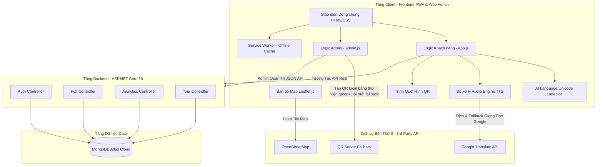
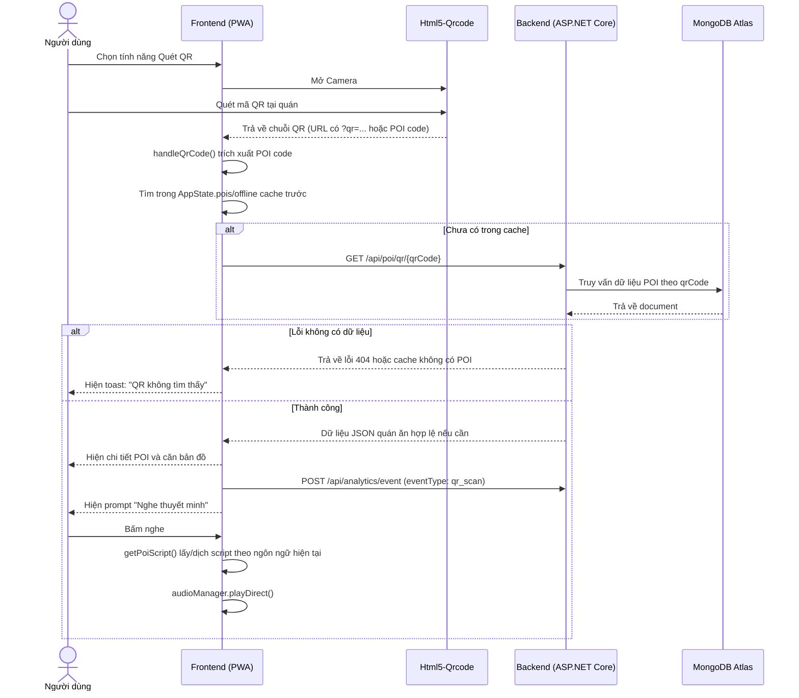
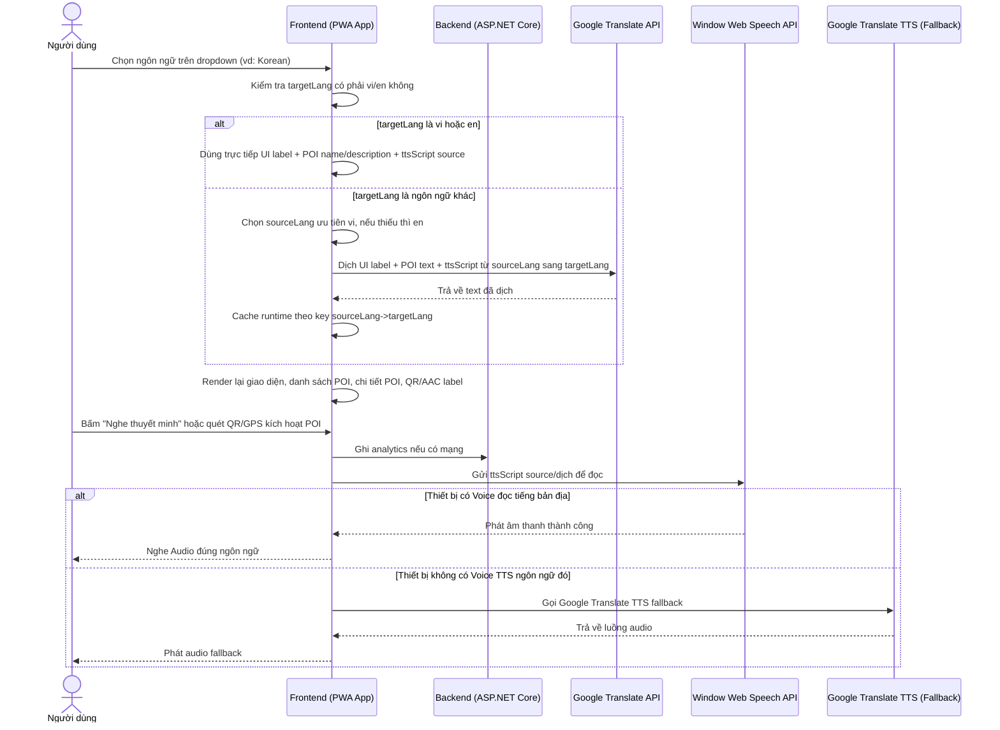
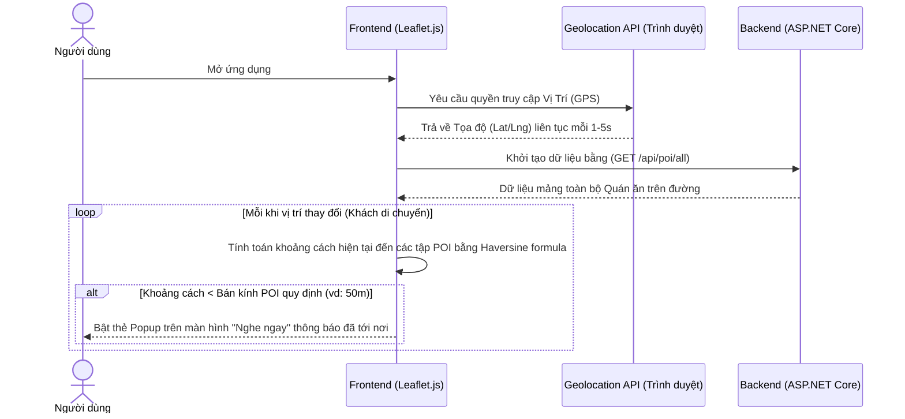
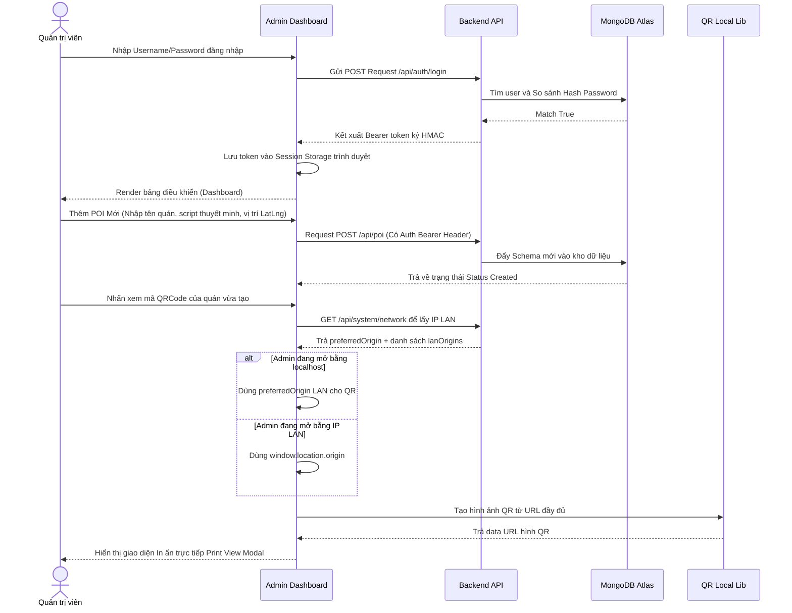
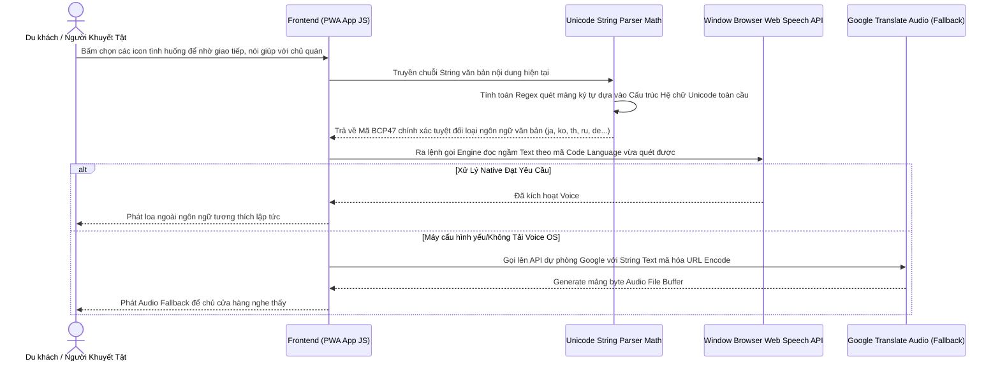
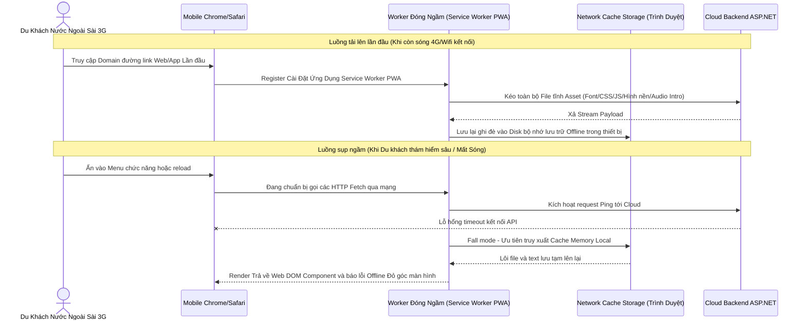

# PRD: Ứng dụng Thuyết minh Đa ngôn ngữ Phố Ẩm thực Vĩnh Khánh 

| Trường | Nội dung |
|---|---|
| Tên dự án | Ứng dụng Thuyết minh Đa ngôn ngữ Phố Ẩm thực Vĩnh Khánh |
| Phiên bản | 1.0 — MVP |
| Trạng thái | Final |
| Phạm vi hệ thống | Progressive Web App (Vanilla JS/HTML5/CSS3) + Web CMS (Admin) + Backend API (ASP.NET Core 10) + Database (MongoDB Atlas) |
| Địa bàn | Phố Vĩnh Khánh, Quận 4, TP.HCM |
| Ngôn ngữ hỗ trợ | 20 ngôn ngữ: VI, EN, JA, ZH, KO, TH, FR, ES, DE, RU, PT, IT, ID, HI, AR, MS, TL, NL, SV, PL — Admin chỉ nhập VI hoặc EN, 18 ngôn ngữ còn lại dịch tự động |
| Mục tiêu học thuật | Đồ án môn học / Tài liệu lưu trữ dự án |

---

## 1. TL;DR
Ứng dụng di động dạng web (PWA) hướng tới du khách tại Phố Vĩnh Khánh (Q4, TPHCM), tự động phát âm thanh thuyết minh đa ngôn ngữ khi đến gần điểm tham quan (POI) qua GPS hoặc quét QR code. Hỗ trợ **20 ngôn ngữ** — Admin chỉ cần nhập nội dung **tiếng Việt hoặc tiếng Anh**, hệ thống tự động dịch sang 18 ngôn ngữ còn lại bằng Google Translate API. Tính năng AAC "Nói giúp tôi" tích hợp AI nhận diện **50+ ngôn ngữ** qua Unicode.

## 2. Goals
### Business Goals
* Đảm bảo POI được mở trong vòng ≤3 giây khi kích hoạt qua GPS hoặc QR code; audio phát ngay sau user gesture nếu mobile browser chặn autoplay.
* Hỗ trợ đầy đủ ngôn ngữ với hệ thống fallback qua Google Translate TTS nếu thiết bị không có sẵn giọng đọc.
* CMS quản lý POI, audio, analytics không cần kỹ năng lập trình cho admin.
* Báo cáo heatmap, bảng xếp hạng POI phổ biến.

### User Goals
* Trải nghiệm nghe thuyết minh tự động, không thao tác thủ công.
* Linh hoạt chọn/đổi ngôn ngữ, dễ dàng gọi người hỗ trợ giao tiếp qua tiếng bản địa.
* Quét QR khi định vị GPS kém ổn định.
* Hỗ trợ lưu trữ offline dữ liệu.

### Non-Goals
* Không tích hợp thanh toán hoặc mua bán trong phiên bản này.
* Không gửi push notification cho người dùng cuối qua server.
* Không yêu cầu tạo tài khoản cho người dùng cuối (du khách).
* Không cam kết dịch máy chính xác 100% như biên dịch viên; bản dịch runtime dùng để hỗ trợ trải nghiệm MVP.
* Không cam kết GPS chính xác tuyệt đối trong hẻm/phố đông nhà cao tầng; QR là luồng kích hoạt ổn định hơn khi GPS sai lệch.

## 3. User Stories (Câu chuyện người dùng)
**Persona 1 — Du khách (End User)**
* Xem bản đồ các quán ăn (POI), tự động nghe audio thuyết minh khi đi gần quán, chọn ngôn ngữ, play/pause/seek, quét mã QR.
* Sử dụng bảng AAC "Nói giúp tôi" để giao tiếp bằng tiếng bản địa với chủ quán.

**Persona 2 — Admin (Quản trị viên)**
* Đăng nhập CMS bằng Bearer token ký HMAC server-side.
* Quản lý CRUD thông tin POI, tạo mã QR, theo dõi Analytics tải heatmap và danh sách quán hot.

## 4. Functional Requirements
* **Authentication & Authorization (High):** Admin đăng nhập nhận Bearer token ký HMAC; API quản trị kiểm tra token trước CRUD/Analytics.
* **Geofencing/GPS (High):** Bắt GPS liên tục. Overlapping POI: chọn ưu tiên khoảng cách gần.
* **QR Code Scanner (High):** Quét mã QR lấy URL/POI code -> mở POI -> hiện prompt nghe để phát audio đúng chính sách trình duyệt mobile.
* **CMS POI Management (High):** Quản lý Tên, tọa độ, mô tả thông tin quán.
* **Analytics (Medium):** Ghi dấu behavior, đếm số lượt nghe hoàn thành và lưu log heatmap. Tính trung bình thời gian nghe.

## 5. Technical Considerations
* **Backend:** C# ASP.NET Core 10 (async), Architecture chuẩn REST.
* **Database:** MongoDB Atlas (NoSQL Document Store).
* **Frontend Mobile / Web CMS:** Progressive Web App (PWA) dùng Vanilla JS, CSS3, HTML5 thay cho React Native. Tận dụng Service Worker và IndexedDB lưu Offline.
* **Bản đồ:** Leaflet.js sử dụng OpenStreetMap.
* **Audio TTS Engine:** Client-side Window Web Speech API. Fallback sang Google Translate API Endpoint nếu thiết bị không có Voice pack.
* **Dịch tự động (Auto-Translation):** Google Translate API (`translate.googleapis.com`) client-side. Admin chỉ cần nhập tiếng Việt hoặc tiếng Anh (có 1 trong 2 là đủ), hệ thống tự dịch sang 18 ngôn ngữ còn lại khi du khách chọn, kết quả được cache trong bộ nhớ.
* **AAC Language Detection:** Bộ nhận diện ngôn ngữ tự viết dựa trên Unicode Range + Pattern Matching, hỗ trợ nhận diện tự động 50+ ngôn ngữ từ văn bản đầu vào.
* **LAN Demo:** Backend bind `0.0.0.0:5000` (HTTP) và `0.0.0.0:5001` (HTTPS); máy chạy demo dùng `http://localhost:5000`, còn điện thoại/giảng viên cùng WiFi sẽ tự động được chuyển hướng sang `https://<IP-LAN-của-máy>:5001` để đảm bảo GPS và Audio hoạt động. Admin QR modal lấy `/api/system/network` để ưu tiên sinh QR bằng HTTPS LAN IP.
* **Bảo mật cấu hình:** Không lưu mật khẩu MongoDB trong `appsettings.json`; demo dùng `appsettings.Local.json` hoặc biến môi trường `MongoDB__ConnectionString`. Nếu chưa có MongoDB, backend chạy demo API in-memory để không trắng màn hình khi bảo vệ.

### 5.1 Language & Translation Strategy (Dễ giải thích khi demo)
* **Ngôn ngữ nguồn cố định:** Admin/CMS chỉ cần nhập nội dung tiếng Việt (`vi`) hoặc tiếng Anh (`en`) cho `name`, `description`, `ttsScript`. Nếu có cả hai thì hệ thống ưu tiên `vi`; nếu thiếu `vi` thì dùng `en`.
* **Ngôn ngữ hiển thị:** Dropdown vẫn hỗ trợ 20 ngôn ngữ cho du khách. `vi` và `en` hiển thị trực tiếp từ source text; 18 ngôn ngữ còn lại được dịch tự động ở Frontend khi user chọn.
* **Runtime translation:** Frontend gọi Google Translate endpoint client-side để dịch UI label, tên/mô tả POI và script thuyết minh từ `vi/en` sang ngôn ngữ đích.
* **Cache client-side:** Kết quả dịch được lưu trong bộ nhớ runtime và `localStorage` của trình duyệt để đổi qua lại ngôn ngữ nhanh hơn, hạn chế gọi dịch lặp khi reload demo.
* **TTS:** Text sau khi chọn/dịch được đưa vào Web Speech API; nếu thiết bị không có voice phù hợp thì fallback sang Google Translate TTS audio.
* **Fallback khi lỗi mạng/dịch:** Nếu chưa dịch được, UI/POI không để trống mà fallback về source `vi/en` để demo vẫn chạy ổn định.

## 6. Business Rules
| Rule | Diễn giải |
|---|---|
| BR-01 | Nếu user khoảng cách ≤ radius -> Quét vùng nhập, tự động kích hoạt Audio. |
| BR-02 | Không spam audio nếu người dùng bấm Dừng (Stop) hoặc thoát vùng nhanh. |
| BR-03 | Chỉ Track lượt nghe (Analytics) khi audio phát END hoặc khi người dùng tác động nút STOP. |
| BR-04 | Quét mã QR là tác vụ chủ động -> Truy cập POI và Audio luôn, không cần check dải tọa độ GPS ngoài khu vực. |
| BR-05 | Client-side TTS: Âm thanh không được tạo dưới backend để tránh sập máy chủ. Text sẽ được Frontend gửi thẳng ra các API âm thanh. |
| BR-06 | Khi du khách chọn ngôn ngữ không phải `vi/en` (vd: Tiếng Hàn) → hệ thống lấy source `vi`, nếu thiếu thì lấy `en` → dịch qua Google Translate API → cache kết quả → render UI/POI và phát audio bằng ngôn ngữ đã chọn. |
| BR-07 | AAC "Nói giúp tôi" sử dụng AI nhận biết tự động hệ ngôn ngữ từ ký tự Unicode mà không cần chọn thủ công. |
| BR-08 | QR dùng trong demo LAN phải encode URL đầy đủ dạng `https://<IP-LAN>:5001/index.html?qr=<POI_CODE>`; kết nối từ HTTPS là bắt buộc để Mobile không chặn GPS. Thống kê qr_scan sẽ hoạt động cho cả QR scan trong app lẫn app Camera hệ thống. |
| BR-09 | Nếu MongoDB/API chưa sẵn sàng khi demo, frontend dùng dữ liệu POI mẫu để vẫn trình bày được bản đồ, đổi ngôn ngữ, QR và TTS. |
| BR-10 | Nếu Google Translate/TTS không khả dụng, app fallback về source `vi/en` và thông báo trạng thái thay vì để giao diện rỗng. |
| BR-11 | QR in tại quán encode URL đầy đủ `/index.html?qr=<POI_CODE>`; app cũng hỗ trợ QR chỉ chứa POI code để dễ test. |
| BR-12 | GPS/geofence là gợi ý tự động; khi GPS lỗi hoặc lệch, UI nhắc dùng QR tại điểm dừng vì đây là luồng ổn định hơn trong phố ẩm thực. |

## 6.1 Acceptance Criteria Cho Demo
* Đổi `VI ↔ EN` phải cập nhật UI ngay, không gọi dịch.
* Đổi sang `JA/KO/SV/PL` phải cập nhật label chính; nếu mạng/dịch lỗi thì fallback `VI/EN` nhưng app không crash.
* Nút test TTS cạnh dropdown phát câu mẫu theo ngôn ngữ đang chọn; riêng `SV` ưu tiên Google TTS fallback vì nhiều máy thiếu Swedish voice.
* Mở app khi chưa cấu hình MongoDB vẫn có POI demo để trình bày bản đồ, danh sách, chi tiết, QR và audio.
* README không chứa password thật; port demo thống nhất là `http://localhost:5000`.

## 6.2 Giới Hạn MVP & Hướng Nâng Cấp
* Google Translate/TTS client-side phù hợp demo học thuật; triển khai production nên dùng API chính thức hoặc backend proxy để kiểm soát quota, log lỗi và bảo mật.
* GPS/geofence chỉ nên xem là gợi ý tự động; QR dán tại quán là luồng thực tế nhất cho phố ẩm thực.
* Mobile browser chặn autoplay audio; app cần prompt/nút nghe để có user gesture.
* AAC Unicode detection là heuristic theo hệ chữ, không phải mô hình AI đảm bảo phân loại chính xác mọi ngôn ngữ Latin.
* Nâng cấp tiếp theo: translation cache IndexedDB, dashboard chart analytics, xuất QR PDF để in, HTTPS/public hosting, và biên tập nội dung thuyết minh thật cho từng quán.

---

## 7. Dữ Liệu Lịch Sử (Data Schema MongoDB — 4 Collections)
* **`pois`**: `id`, `name` (`vi/en` source, có thể còn seed fallback), `description` (`vi/en` source), `category`, `latitude`, `longitude`, `radius`, `priority`, `ttsScript` (`vi/en` source), `qrCode`, `address`, `openingHours`, `priceRange`, `isActive`, `createdAt`.
* **`analytics`**: `id`, `sessionId`, `eventType` (`poi_enter`, `poi_listen`, `poi_complete`, `qr_scan`, `location_update`), `poiId`, `duration`, `latitude`, `longitude`, `timestamp`.
* **`tours`**: `id`, `name` (đa ngôn ngữ), `description` (đa ngôn ngữ), `poiIds` (danh sách POI theo thứ tự), `estimatedDuration` (phút), `estimatedDistance` (km), `isActive`, `createdAt`.
* **`users`**: `id`, `username`, `passwordHash`, `role` (`admin`, `editor`), `createdAt`.

---

## 8. Sơ Đồ Kiến Trúc Hệ Thống (System Architecture Diagram)

---

## 9. Sơ Đồ Chuỗi Xử Lý (Sequence Diagrams)

### 9.1 Luồng Xử Lý Quét Mã QR

### 9.2 Luồng Đổi Ngôn Ngữ, Dịch Runtime và Phát Thuyết Minh

**Điểm cần nhớ khi bảo vệ:** Backend chỉ lưu source text `vi/en`; logic dịch nằm trong `app.js` ở các hàm `isSourceLanguage()`, `getSourceLanguage()`, `translateWithCache()`, `getLocalizedPoiText()`, `applyUILanguage()`.

### 9.3 Luồng Tính Năng Bản Đồ và Geofencing Hàng Rào Ảo

### 9.4 Luồng Xác Thực và Quản Trị Hệ Thống (CMS Admin)

### 9.5 Luồng Giao Tiếp Người Khuyết Tật Hỗ Trợ Đa Ngôn Ngữ (AAC) (Nhận Diện Ngôn Ngữ Thông Minh AI)

### 9.6 Luồng Xử Lý Mất Kết Nối Mạng Tạm Thời PWA (Offline Capability)

