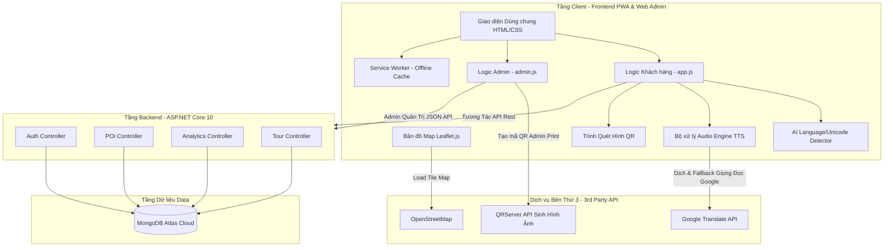
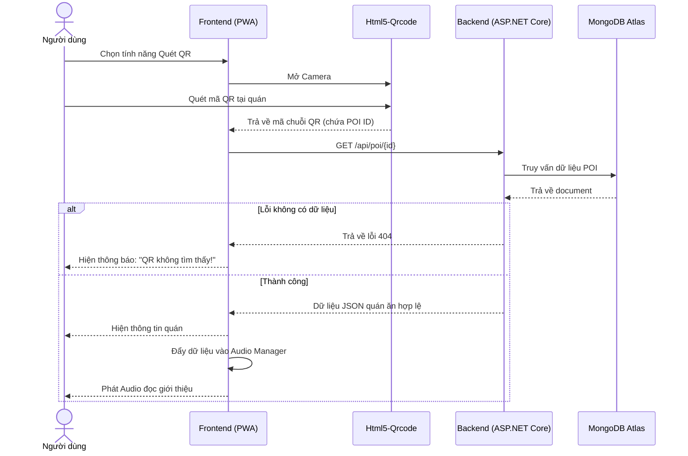
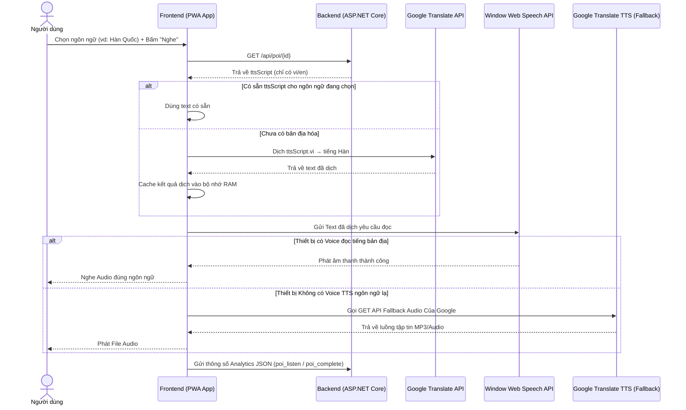
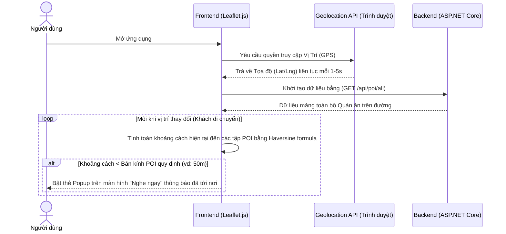
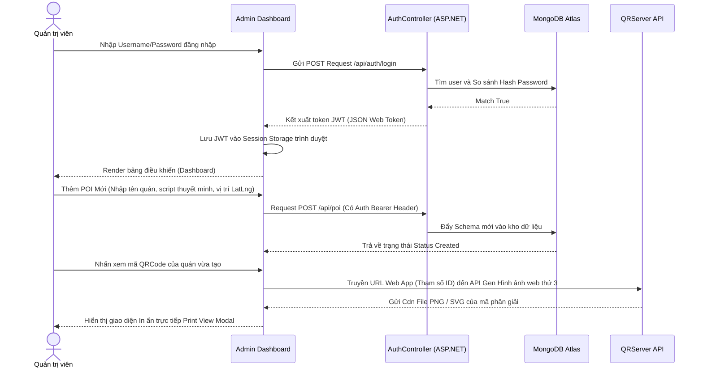
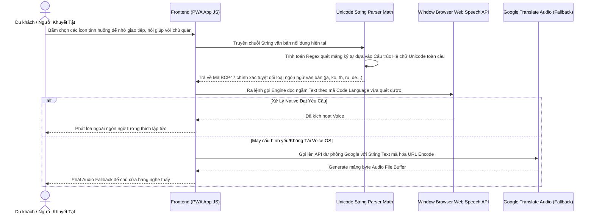
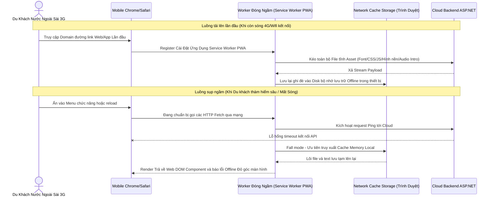

# PRD: Ứng dụng Thuyết minh Đa ngôn ngữ Phố Ẩm thực Vĩnh Khánh 

| Trường | Nội dung |
|---|---|
| Tên dự án | Ứng dụng Thuyết minh Đa ngôn ngữ Phố Ẩm thực Vĩnh Khánh |
| Phiên bản | 1.0 — MVP |
| Trạng thái | Final |
| Phạm vi hệ thống | Progressive Web App (Vanilla JS/HTML5/CSS3) + Web CMS (Admin) + Backend API (ASP.NET Core 10) + Database (MongoDB Atlas) |
| Địa bàn | Phố Vĩnh Khánh, Quận 4, TP.HCM |
| Ngôn ngữ hỗ trợ | 20 ngôn ngữ: VI, EN, JA, ZH, KO, TH, FR, ES, DE, RU, PT, IT, ID, HI, AR, MS, TL, NL, SV, PL — Admin chỉ nhập VI hoặc EN, 18 ngôn ngữ còn lại dịch tự động |
| Mục tiêu học thuật | Đồ án môn học / Tài liệu lưu trữ dự án |

---

## 1. TL;DR
Ứng dụng di động dạng web (PWA) hướng tới du khách tại Phố Vĩnh Khánh (Q4, TPHCM), tự động phát âm thanh thuyết minh đa ngôn ngữ khi đến gần điểm tham quan (POI) qua GPS hoặc quét QR code. Hỗ trợ **20 ngôn ngữ** — Admin chỉ cần nhập nội dung **tiếng Việt hoặc tiếng Anh**, hệ thống tự động dịch sang 18 ngôn ngữ còn lại bằng Google Translate API. Tính năng AAC "Nói giúp tôi" tích hợp AI nhận diện **50+ ngôn ngữ** qua Unicode.

## 2. Goals
### Business Goals
* Đảm bảo audio phát tự động trong vòng ≤3 giây khi kích hoạt qua GPS hoặc QR code.
* Hỗ trợ đầy đủ ngôn ngữ với hệ thống fallback qua Google Translate TTS nếu thiết bị không có sẵn giọng đọc.
* CMS quản lý POI, audio, analytics không cần kỹ năng lập trình cho admin.
* Báo cáo heatmap, bảng xếp hạng POI phổ biến.

### User Goals
* Trải nghiệm nghe thuyết minh tự động, không thao tác thủ công.
* Linh hoạt chọn/đổi ngôn ngữ, dễ dàng gọi người hỗ trợ giao tiếp qua tiếng bản địa.
* Quét QR khi định vị GPS kém ổn định.
* Hỗ trợ lưu trữ offline dữ liệu.

### Non-Goals
* Không tích hợp thanh toán hoặc mua bán trong phiên bản này.
* Không gửi push notification cho người dùng cuối qua server.
* Không yêu cầu tạo tài khoản cho người dùng cuối (du khách).

## 3. User Stories (Câu chuyện người dùng)
**Persona 1 — Du khách (End User)**
* Xem bản đồ các quán ăn (POI), tự động nghe audio thuyết minh khi đi gần quán, chọn ngôn ngữ, play/pause/seek, quét mã QR.
* Sử dụng bảng AAC "Nói giúp tôi" để giao tiếp bằng tiếng bản địa với chủ quán.

**Persona 2 — Admin (Quản trị viên)**
* Đăng nhập CMS bảo mật bằng JWT.
* Quản lý CRUD thông tin POI, tạo mã QR, theo dõi Analytics tải heatmap và danh sách quán hot.

## 4. Functional Requirements
* **Authentication & Authorization (High):** JWT-based authentication cho Admin.
* **Geofencing/GPS (High):** Bắt GPS liên tục. Overlapping POI: chọn ưu tiên khoảng cách gần.
* **QR Code Scanner (High):** Quét mã QR lấy POI Id -> Lấy dữ liệu và Phát Audio ngay lập tức.
* **CMS POI Management (High):** Quản lý Tên, tọa độ, mô tả thông tin quán.
* **Analytics (Medium):** Ghi dấu behavior, đếm số lượt nghe hoàn thành và lưu log heatmap. Tính trung bình thời gian nghe.

## 5. Technical Considerations
* **Backend:** C# ASP.NET Core 10 (async), Architecture chuẩn REST.
* **Database:** MongoDB Atlas (NoSQL Document Store).
* **Frontend Mobile / Web CMS:** Progressive Web App (PWA) dùng Vanilla JS, CSS3, HTML5 thay cho React Native. Tận dụng Service Worker và IndexedDB lưu Offline.
* **Bản đồ:** Leaflet.js sử dụng OpenStreetMap.
* **Audio TTS Engine:** Client-side Window Web Speech API. Fallback sang Google Translate API Endpoint nếu thiết bị không có Voice pack.
* **Dịch tự động (Auto-Translation):** Google Translate API (`translate.googleapis.com`) client-side. Admin chỉ cần nhập tiếng Việt hoặc tiếng Anh (có 1 trong 2 là đủ), hệ thống tự dịch sang 18 ngôn ngữ còn lại khi du khách chọn, kết quả được cache trong bộ nhớ.
* **AAC Language Detection:** Bộ nhận diện ngôn ngữ tự viết dựa trên Unicode Range + Pattern Matching, hỗ trợ nhận diện tự động 50+ ngôn ngữ từ văn bản đầu vào.

## 6. Business Rules
| Rule | Diễn giải |
|---|---|
| BR-01 | Nếu user khoảng cách ≤ radius -> Quét vùng nhập, tự động kích hoạt Audio. |
| BR-02 | Không spam audio nếu người dùng bấm Dừng (Stop) hoặc thoát vùng nhanh. |
| BR-03 | Chỉ Track lượt nghe (Analytics) khi audio phát END hoặc khi người dùng tác động nút STOP. |
| BR-04 | Quét mã QR là tác vụ chủ động -> Truy cập POI và Audio luôn, không cần check dải tọa độ GPS ngoài khu vực. |
| BR-05 | Client-side TTS: Âm thanh không được tạo dưới backend để tránh sập máy chủ. Text sẽ được Frontend gửi thẳng ra các API âm thanh. |
| BR-06 | Khi du khách chọn ngôn ngữ chưa có sẵn trong DB (vd: Tiếng Hàn) → hệ thống tự động dịch ttsScript từ tiếng Việt sang tiếng Hàn qua Google Translate API → Cache kết quả → Phát Audio bằng đúng ngôn ngữ đã chọn. |
| BR-07 | AAC "Nói giúp tôi" sử dụng AI nhận biết tự động hệ ngôn ngữ từ ký tự Unicode mà không cần chọn thủ công. |

---

## 7. Dữ Liệu Lịch Sử (Data Schema MongoDB — 4 Collections)
* **`pois`**: `id`, `name` (đa ngôn ngữ), `description` (đa ngôn ngữ), `category`, `latitude`, `longitude`, `radius`, `priority`, `ttsScript` (đa ngôn ngữ), `qrCode`, `address`, `openingHours`, `priceRange`, `isActive`, `createdAt`.
* **`analytics`**: `id`, `sessionId`, `eventType` (`poi_enter`, `poi_listen`, `poi_complete`, `qr_scan`, `location_update`), `poiId`, `duration`, `latitude`, `longitude`, `timestamp`.
* **`tours`**: `id`, `name` (đa ngôn ngữ), `description` (đa ngôn ngữ), `poiIds` (danh sách POI theo thứ tự), `estimatedDuration` (phút), `estimatedDistance` (km), `isActive`, `createdAt`.
* **`users`**: `id`, `username`, `passwordHash`, `role` (`admin`, `editor`), `createdAt`.

---

## 8. Sơ Đồ Kiến Trúc Hệ Thống (System Architecture Diagram)

---

## 9. Sơ Đồ Chuỗi Xử Lý (Sequence Diagrams)

### 9.1 Luồng Xử Lý Quét Mã QR

### 9.2 Luồng Phát Thuyết Minh Đa Ngôn Ngữ (Có Dịch Thuật AI Tự Động)

### 9.3 Luồng Tính Năng Bản Đồ và Geofencing Hàng Rào Ảo

### 9.4 Luồng Xác Thực và Quản Trị Hệ Thống (CMS Admin)

### 9.5 Luồng Giao Tiếp Người Khuyết Tật Hỗ Trợ Đa Ngôn Ngữ (AAC) (Nhận Diện Ngôn Ngữ Thông Minh AI)

### 9.6 Luồng Xử Lý Mất Kết Nối Mạng Tạm Thời PWA (Offline Capability)

