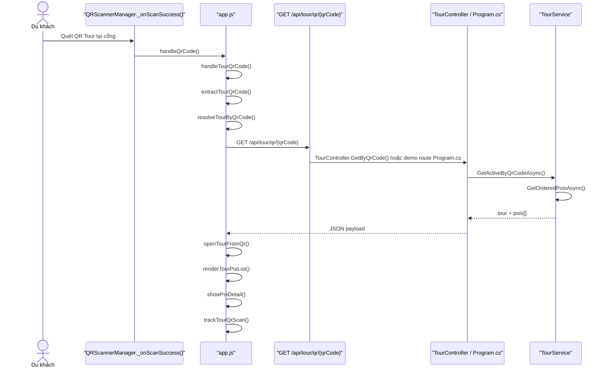
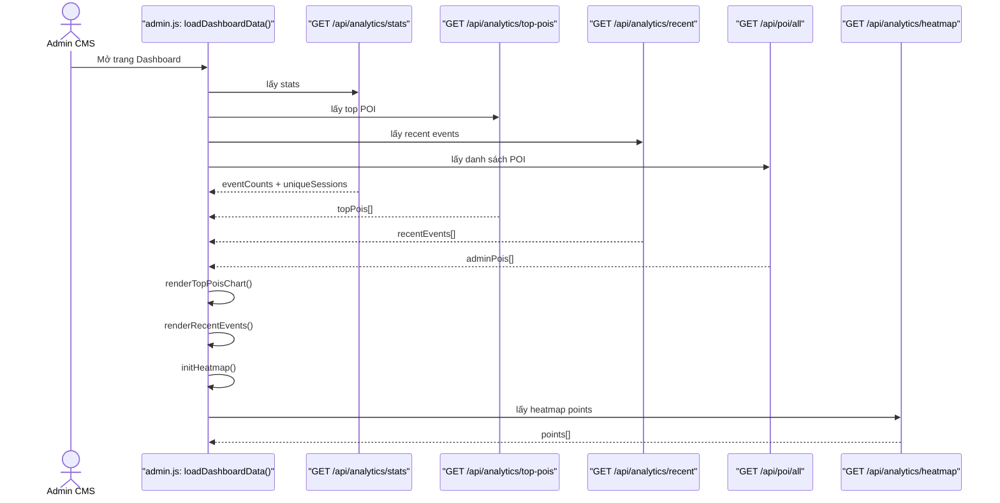
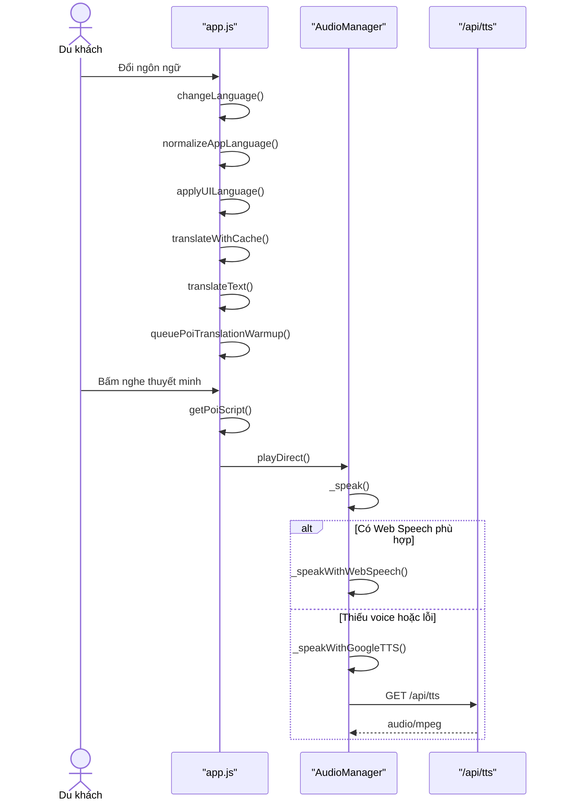
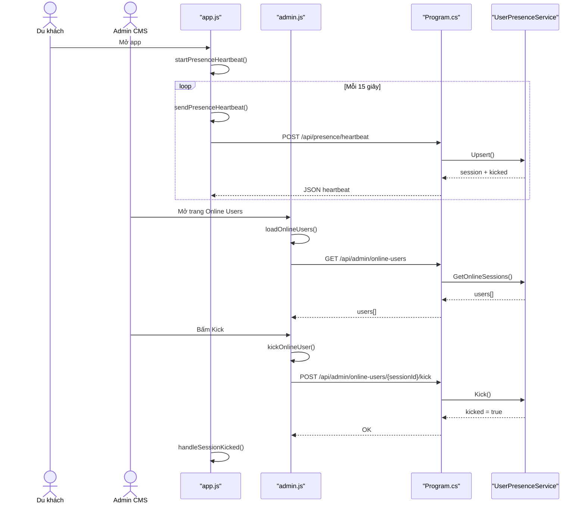
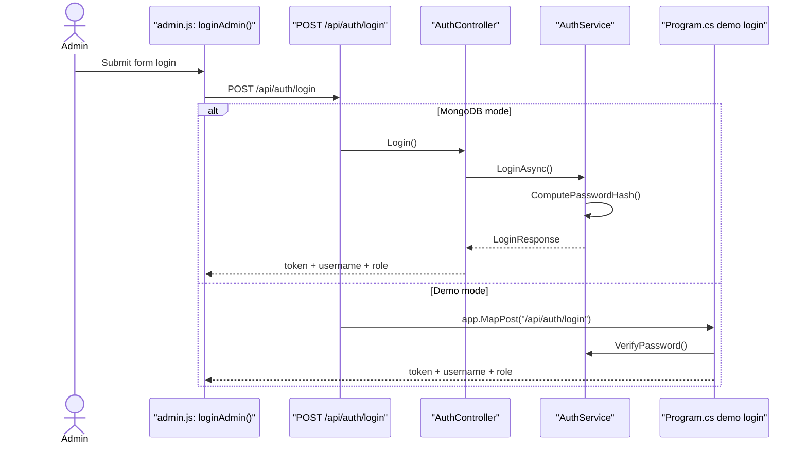
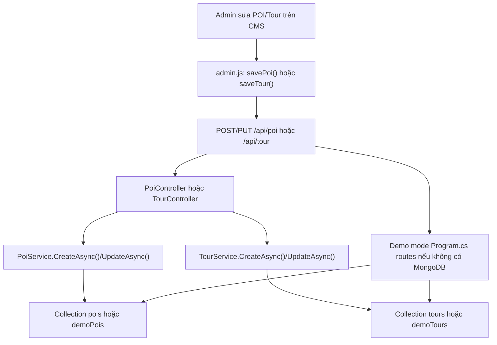

# PRD: Ứng dụng Thuyết minh Đa ngôn ngữ Phố Ẩm thực Vĩnh Khánh

| Trường | Nội dung |
|---|---|
| Tên dự án | Ứng dụng Thuyết minh Đa ngôn ngữ Phố Ẩm thực Vĩnh Khánh |
| Phiên bản | 1.1 - Demo ổn định |
| Trạng thái | Final for Demo |
| Phạm vi | PWA du khách + CMS Admin + Backend ASP.NET Core 10 + MongoDB/demo in-memory |
| Địa bàn | Phố Vĩnh Khánh, Quận 4, TP.HCM |
| Ngôn ngữ hỗ trợ | 20 ngôn ngữ: `vi`, `en`, `ja`, `zh`, `ko`, `th`, `fr`, `es`, `de`, `ru`, `pt`, `it`, `id`, `hi`, `ar`, `ms`, `tl`, `nl`, `sv`, `pl` |
| Mục tiêu học thuật | Demo đồ án ổn định, dễ giải thích theo hàm, endpoint, service và dữ liệu |

---

## 1. TL;DR
Ứng dụng là một PWA phục vụ du khách tại phố ẩm thực Vĩnh Khánh. Người dùng mở bản đồ, đi gần điểm POI hoặc quét QR Tour để xem danh sách quán theo thứ tự và nghe thuyết minh. Admin dùng CMS để đăng nhập, quản lý POI/Tour, xem dashboard analytics, theo dõi người dùng online và kick session khi cần.

Điểm quan trọng của bản này:
- Tài khoản admin được seed bằng **password hash**, không lưu plaintext trong database seed hoặc demo seed.
- QR Tour tại cổng mở đúng danh sách quán theo thứ tự tour.
- Dashboard có đủ `stats`, `top-pois`, `recent`, `heatmap`; demo mode có seed analytics để không trắng dữ liệu.
- File này có truy vết hàm thật để trả lời được câu hỏi kiểu “bấm nút này thì gọi hàm nào, endpoint nào, service nào”.

---

## 2. Goals

### 2.1 Business Goals
- Demo được đầy đủ luồng chính: đăng nhập admin, QR Tour, audio đa ngôn ngữ, dashboard analytics, online users.
- Không phụ thuộc hoàn toàn MongoDB; nếu chưa có DB thật thì demo mode vẫn trình bày được chức năng.
- Khi giảng viên chỉ vào chức năng bất kỳ, có thể truy ngay từ màn hình -> hàm frontend -> API -> controller/service -> dữ liệu.

### 2.2 User Goals
- Du khách xem bản đồ, nghe thuyết minh, quét QR, đổi ngôn ngữ và dùng AAC “Nói giúp tôi”.
- Admin đăng nhập dễ dàng, sửa POI/Tour, in QR Tour, xem số liệu nghe và QR scan, theo dõi session online.

### 2.3 Non-Goals
- Không làm security nâng cao như refresh token, CSRF, rate limit, phân quyền phức tạp.
- Không tích hợp thanh toán, push notification, hay tài khoản du khách.
- Không biến dashboard thành BI production; chỉ cần số liệu đủ demo và dễ giải thích.

---

## 3. Kiến trúc hệ thống

### 3.1 Frontend
- `CShape/VinhKhanhFoodTour.Api/wwwroot/index.html`: giao diện PWA cho du khách.
- `CShape/VinhKhanhFoodTour.Api/wwwroot/admin.html`: giao diện CMS Admin.
- `CShape/VinhKhanhFoodTour.Api/wwwroot/js/app.js`: điều phối map, QR, i18n, presence, offline, AAC.
- `CShape/VinhKhanhFoodTour.Api/wwwroot/js/audio-manager.js`: xử lý audio Web Speech + Google TTS fallback.
- `CShape/VinhKhanhFoodTour.Api/wwwroot/js/geofence.js`: GPS/geofence + track location.
- `CShape/VinhKhanhFoodTour.Api/wwwroot/js/admin.js`: login admin, dashboard, CRUD POI/Tour, QR viewer, online users.
- `CShape/VinhKhanhFoodTour.Api/wwwroot/sw.js`: service worker cho shell offline.
- `CShape/VinhKhanhFoodTour.Api/wwwroot/js/offline-db.js`: IndexedDB cache POI.

### 3.2 Backend
- `Program.cs`: bootstrap app, route minimal API cho demo mode, `/api/tts`, `/api/presence`, `/api/admin/online-users`, seed demo analytics.
- `Controllers/AuthController.cs:20`: login admin trong MongoDB mode.
- `Controllers/PoiController.cs:55`: CRUD POI.
- `Controllers/TourController.cs:19`: QR Tour + CRUD Tour.
- `Controllers/AnalyticsController.cs:27`: dashboard analytics.

### 3.3 Services
- `Services/AuthService.cs:21`: login bằng hash.
- `Services/PoiService.cs:27`: tạo/sửa/xóa POI và seed POI mẫu.
- `Services/TourService.cs:24`: resolve QR Tour, sắp đúng thứ tự POI, CRUD Tour.
- `Services/AnalyticsService.cs:18`: track event, thống kê top POI, heatmap, recent, unique sessions.
- `Services/UserPresenceService.cs:11`: heartbeat online, window 45 giây, kick session.

### 3.4 Data
- MongoDB mode dùng các collection: `pois`, `tours`, `analytics`, `users`.
- Demo mode dùng in-memory:
  - `demoPois`
  - `demoTours`
  - `analyticsEvents` seed từ `CreateDemoAnalyticsEvents()` tại `Program.cs:582`

---

## 4. Business Rules

| Mã | Rule |
|---|---|
| BR-01 | Nếu user vào vùng geofence của POI thì hiển thị gợi ý nghe và queue audio. |
| BR-02 | QR chính để demo là **QR Tour tại cổng**, mở danh sách quán theo thứ tự tour. |
| BR-03 | `poi_listen` được ghi khi audio kết thúc hoặc khi người dùng dừng phát. |
| BR-04 | Admin login dùng password hash: hash đầu vào rồi so sánh hash đã seed/lưu. |
| BR-05 | Demo mode phải có sẵn ít nhất một ít analytics để dashboard không trắng dữ liệu. |
| BR-06 | Online user được tính online nếu heartbeat trong 45 giây gần nhất và chưa bị kick. |
| BR-07 | Nếu thiết bị thiếu voice phù hợp, audio fallback sang `/api/tts`. |
| BR-08 | Nếu API/DB lỗi, app du khách vẫn fallback POI demo/offline cache thay vì crash. |

---

## 5. Acceptance Criteria cho demo

- Đăng nhập admin hoạt động ở cả MongoDB mode (`AuthController` + `AuthService`) và demo mode (`Program.cs:317`).
- Password admin không lưu plaintext trong seed user; source dùng hash cố định tại `AuthService.cs:11`.
- Bấm “Thêm POI” và “Thêm Tour” không lỗi runtime.
- Quét QR Tour tại cổng mở đúng tour và hiển thị các quán theo thứ tự.
- Dashboard hiển thị được `QR Scans`, `Top POIs`, `Recent Activities`, `Heatmap`.
- Online Users có danh sách session và kick được.
- Đổi ngôn ngữ không crash; audio có fallback nếu dịch/TTS lỗi.

---

## 6. Requirement Traceability Matrix

| ID | Requirement | Loại | Ưu tiên | Trạng thái |
|---|---|---|---|---|
| FR-01 | Admin login bằng token và password hash | Backend, Frontend | High | Implemented |
| FR-02 | QR Tour mở đúng danh sách quán theo thứ tự | Frontend, Backend, Integration | High | Implemented |
| FR-03 | Dashboard analytics hiển thị stats/top/recent/heatmap | Backend, Frontend | High | Implemented |
| FR-04 | Audio đa ngôn ngữ + fallback TTS | Frontend, Integration | High | Implemented |
| FR-05 | Online users + kick session | Backend, Frontend | Medium | Implemented |
| FR-06 | CRUD POI | Backend, Frontend, Data | High | Implemented |
| FR-07 | CRUD Tour mức đủ demo | Backend, Frontend, Data | Medium | Implemented |
| FR-08 | Offline cache POI + service worker | Frontend | Medium | Implemented |
| FR-09 | AAC phát hiện ngôn ngữ từ Unicode | Frontend | Medium | Implemented |

---

## 7. Truy vết chi tiết theo Functional Requirement

### FR-01. Admin Login + Password Hash

| Trường | Nội dung |
|---|---|
| Màn hình/chức năng | Form đăng nhập CMS Admin |
| User thao tác gì | Nhập username/password, bấm Đăng nhập |
| File frontend | `wwwroot/admin.html`, `wwwroot/js/admin.js` |
| Hàm frontend được gọi | `loginAdmin()` tại `admin.js:43` |
| API endpoint | `POST /api/auth/login` |
| File backend/controller/service | `Controllers/AuthController.cs:20`, `Services/AuthService.cs:21`, demo mode ở `Program.cs:317` |
| Hàm backend/service được gọi | `AuthController.Login()` -> `AuthService.LoginAsync()`; demo mode dùng `AuthService.VerifyPassword()` |
| Dữ liệu MongoDB/demo data liên quan | `users.passwordHash`; hash mặc định tại `AuthService.cs:11` |
| Cách demo nhanh | Đăng nhập tài khoản `admin`, backend trả token, frontend lưu `sessionStorage.adminToken` |

### FR-02. QR Tour tại cổng

| Trường | Nội dung |
|---|---|
| Màn hình/chức năng | Nút quét QR trong app du khách hoặc camera điện thoại quét QR in từ CMS |
| User thao tác gì | Quét QR Tour tại cổng |
| File frontend | `wwwroot/js/qr-scanner.js`, `wwwroot/js/app.js` |
| Hàm frontend được gọi | `QRScannerManager._onScanSuccess()` -> `handleQrCode()` `app.js:1085` -> `handleTourQrCode()` `app.js:1103` -> `resolveTourByQrCode()` `app.js:1137` -> `openTourFromQr()` `app.js:1176` -> `renderTourPoiList()` `app.js:1492` -> `showPoiDetail()` -> `trackTourQrScan()` |
| API endpoint | `GET /api/tour/qr/{qrCode}` |
| File backend/controller/service | `Controllers/TourController.cs:19`, `Services/TourService.cs:24`, demo mode `Program.cs:376` |
| Hàm backend/service được gọi | `TourController.GetByQrCode()` -> `TourService.GetActiveByQrCodeAsync()` -> `TourService.GetOrderedPoisAsync()` |
| Dữ liệu MongoDB/demo data liên quan | `tours.qrCode`, `tours.poiIds`, `pois`; demo seed `CreateDemoTours()` ở `Program.cs:555` |
| Cách demo nhanh | Mở CMS -> Quản lý Tour -> QR Tour -> in hoặc quét QR -> app mở danh sách quán theo thứ tự |

### FR-03. Dashboard Analytics

| Trường | Nội dung |
|---|---|
| Màn hình/chức năng | Dashboard CMS |
| User thao tác gì | Mở trang Dashboard hoặc refresh định kỳ 5 giây |
| File frontend | `wwwroot/js/admin.js` |
| Hàm frontend được gọi | `loadDashboardData()` `admin.js:454` -> `renderTopPoisChart()` `admin.js:490` -> `renderRecentEvents()` `admin.js:515` -> `initHeatmap()` `admin.js:544` |
| API endpoint | `GET /api/analytics/stats`, `GET /api/analytics/top-pois`, `GET /api/analytics/recent`, `GET /api/analytics/heatmap`, `GET /api/poi/all` |
| File backend/controller/service | `Controllers/AnalyticsController.cs:27/36/45/61`, `Services/AnalyticsService.cs:26/45/93/106/112`, demo mode `Program.cs:431/441/464/507` |
| Hàm backend/service được gọi | `GetEventCountsAsync()`, `GetUniqueSessionsAsync()`, `GetTopPoiStatsAsync()`, `GetHeatmapDataAsync()`, `GetRecentEventsAsync()` |
| Dữ liệu MongoDB/demo data liên quan | `analytics`, `pois`; demo seed `CreateDemoAnalyticsEvents()` ở `Program.cs:582` |
| Cách demo nhanh | Đăng nhập CMS -> Dashboard -> chỉ vào `QR Scans`, `Top POIs`, `Recent`, `Heatmap` |

### FR-04. Audio + Dịch ngôn ngữ

| Trường | Nội dung |
|---|---|
| Màn hình/chức năng | Dropdown ngôn ngữ + nút nghe thuyết minh |
| User thao tác gì | Đổi ngôn ngữ, bấm nghe |
| File frontend | `wwwroot/js/app.js`, `wwwroot/js/audio-manager.js` |
| Hàm frontend được gọi | `changeLanguage()` `app.js:1440` -> `translateWithCache()` `app.js:167` -> `translateText()` `app.js:878` -> `queuePoiTranslationWarmup()` `app.js:227` -> `getPoiScript()` `app.js:851` -> `AudioManager.playDirect()` `audio-manager.js:222` -> `_speak()` `audio-manager.js:252` -> `_speakWithWebSpeech()` `audio-manager.js:286` hoặc `_speakWithGoogleTTS()` `audio-manager.js:354` |
| API endpoint | `GET /api/tts` |
| File backend/controller/service | demo/minimal API tại `Program.cs:515` |
| Hàm backend/service được gọi | TTS proxy trong `Program.cs` |
| Dữ liệu MongoDB/demo data liên quan | `pois.name`, `pois.description`, `pois.ttsScript` |
| Cách demo nhanh | Đổi `VI` -> `EN` -> một ngôn ngữ khác như `KO`; bấm nút nghe hoặc nút test TTS |

### FR-05. Online Users + Kick

| Trường | Nội dung |
|---|---|
| Màn hình/chức năng | Trang Online Users trong CMS |
| User thao tác gì | Mở app du khách để heartbeat, CMS mở Online Users, bấm Kick |
| File frontend | `wwwroot/js/app.js`, `wwwroot/js/admin.js` |
| Hàm frontend được gọi | `startPresenceHeartbeat()` `app.js:569` -> `sendPresenceHeartbeat()` `app.js:577`; admin dùng `loadOnlineUsers()` `admin.js:397` và `kickOnlineUser()` `admin.js:435`; client nhận kick ở `handleSessionKicked()` `app.js:613` |
| API endpoint | `POST /api/presence/heartbeat`, `GET /api/admin/online-users`, `POST /api/admin/online-users/{sessionId}/kick` |
| File backend/controller/service | `Program.cs:130/145/156`, `Services/UserPresenceService.cs:11/58` |
| Hàm backend/service được gọi | `UserPresenceService.Upsert()`, `UserPresenceService.GetOnlineSessions()`, `UserPresenceService.Kick()` |
| Dữ liệu MongoDB/demo data liên quan | `presenceSessions` in-memory singleton |
| Cách demo nhanh | Mở app trên điện thoại/laptop khác -> vào CMS -> Online Users -> Kick -> app hiện màn hình “Phiên đã bị ngắt” |

### FR-06. CRUD POI

| Trường | Nội dung |
|---|---|
| Màn hình/chức năng | Quản lý POIs |
| User thao tác gì | Thêm, sửa, ẩn/hiện, xóa, xem QR điểm |
| File frontend | `wwwroot/admin.html`, `wwwroot/js/admin.js` |
| Hàm frontend được gọi | `savePoi()` `admin.js:701`, `editPoi()`, `togglePoiStatus()`, `deletePoi()`, `viewQr()` `admin.js:1117` |
| API endpoint | `GET /api/poi/all`, `POST /api/poi`, `PUT /api/poi/{id}`, `DELETE /api/poi/{id}` |
| File backend/controller/service | `Controllers/PoiController.cs:19/54/63/74`, `Services/PoiService.cs:27/35/42`, demo mode `Program.cs:333/337/343/353/364` |
| Hàm backend/service được gọi | `PoiService.CreateAsync()`, `UpdateAsync()`, `DeleteAsync()` |
| Dữ liệu MongoDB/demo data liên quan | `pois` / `demoPois` |
| Cách demo nhanh | Vào POIs -> Thêm POI mới -> lưu -> xem ngay ở bảng và QR |

### FR-07. CRUD Tour mức đủ demo

| Trường | Nội dung |
|---|---|
| Màn hình/chức năng | Quản lý Tours |
| User thao tác gì | Thêm, sửa, xóa, xem QR Tour |
| File frontend | `wwwroot/admin.html`, `wwwroot/js/admin.js` |
| Hàm frontend được gọi | `loadTours()` `admin.js:798`, `openTourModal()` `admin.js:857`, `saveTour()` `admin.js:893`, `editTour()`, `deleteTour()`, `viewTourQr()` `admin.js:1097` |
| API endpoint | `GET /api/tour`, `POST /api/tour`, `PUT /api/tour/{id}`, `DELETE /api/tour/{id}` |
| File backend/controller/service | `Controllers/TourController.cs:46/54/64`, `Services/TourService.cs:61/72/78`, demo mode `Program.cs:397/406/417` |
| Hàm backend/service được gọi | `TourService.CreateAsync()`, `UpdateAsync()`, `DeleteAsync()` |
| Dữ liệu MongoDB/demo data liên quan | `tours.qrCode`, `tours.poiIds`; demo `demoTours` |
| Cách demo nhanh | Vào Tours -> Thêm Tour -> tick 2-3 POI -> lưu -> mở QR Tour |

### FR-08. Offline cache PWA

| Trường | Nội dung |
|---|---|
| Màn hình/chức năng | App du khách khi mất mạng |
| User thao tác gì | Mở app, rồi ngắt mạng |
| File frontend | `wwwroot/sw.js`, `wwwroot/js/offline-db.js`, `wwwroot/js/app.js`, `wwwroot/index.html` |
| Hàm frontend được gọi | `navigator.serviceWorker.register()` `index.html:379`; `offlineDB.savePois()` `app.js:727`; `offlineDB.loadPois()` `app.js:740` |
| API endpoint | `GET /api/poi` khi online |
| File backend/controller/service | `Controllers/PoiController.cs:19`, demo mode `Program.cs:333` |
| Hàm backend/service được gọi | `PoiService.GetActiveAsync()` |
| Dữ liệu MongoDB/demo data liên quan | `pois` hoặc fallback `getDemoPois()` `app.js:780` |
| Cách demo nhanh | Mở app lần đầu có mạng -> tắt mạng -> refresh -> app vẫn có dữ liệu POI cache |

### FR-09. AAC “Nói giúp tôi”

| Trường | Nội dung |
|---|---|
| Màn hình/chức năng | Modal AAC |
| User thao tác gì | Nhập câu hoặc chọn câu mẫu, bấm phát |
| File frontend | `wwwroot/js/app.js` |
| Hàm frontend được gọi | `aacSpeak()` -> `detectLanguage()` `app.js:2074` -> `_aacGoogleTTS()` `app.js:2025` khi thiếu voice |
| API endpoint | Dùng trực tiếp Google TTS ở luồng AAC fallback |
| File backend/controller/service | Không qua backend ở luồng AAC fallback hiện tại |
| Hàm backend/service được gọi | Không có |
| Dữ liệu MongoDB/demo data liên quan | Câu mẫu trong frontend |
| Cách demo nhanh | Mở modal “Nói giúp tôi” -> nhập câu tiếng Việt/Hàn/Nhật -> bấm phát |

---

## 8. Sequence Flows theo hàm thật

### 8.1 QR Tour

```mermaid
sequenceDiagram
    actor User as Du khách
    participant Scanner as "QRScannerManager._onScanSuccess()"
    participant App as "app.js"
    participant API as "GET /api/tour/qr/{qrCode}"
    participant Backend as "TourController / Program.cs"
    participant Service as "TourService"

    User->>Scanner: Quét QR Tour tại cổng
    Scanner->>App: handleQrCode()
    App->>App: handleTourQrCode()
    App->>App: extractTourQrCode()
    App->>App: resolveTourByQrCode()
    App->>API: GET /api/tour/qr/{qrCode}
    API->>Backend: TourController.GetByQrCode() hoặc demo route Program.cs
    Backend->>Service: GetActiveByQrCodeAsync()
    Service->>Service: GetOrderedPoisAsync()
    Service-->>Backend: tour + pois[]
    Backend-->>App: JSON payload
    App->>App: openTourFromQr()
    App->>App: renderTourPoiList()
    App->>App: showPoiDetail()
    App->>App: trackTourQrScan()
```

### 8.2 Dashboard

```mermaid
sequenceDiagram
    actor Admin as Admin CMS
    participant Frontend as "admin.js: loadDashboardData()"
    participant Stats as "GET /api/analytics/stats"
    participant TopPois as "GET /api/analytics/top-pois"
    participant Recent as "GET /api/analytics/recent"
    participant PoiAll as "GET /api/poi/all"
    participant Heatmap as "GET /api/analytics/heatmap"

    Admin->>Frontend: Mở trang Dashboard
    Frontend->>Stats: lấy stats
    Frontend->>TopPois: lấy top POI
    Frontend->>Recent: lấy recent events
    Frontend->>PoiAll: lấy danh sách POI
    Stats-->>Frontend: eventCounts + uniqueSessions
    TopPois-->>Frontend: topPois[]
    Recent-->>Frontend: recentEvents[]
    PoiAll-->>Frontend: adminPois[]
    Frontend->>Frontend: renderTopPoisChart()
    Frontend->>Frontend: renderRecentEvents()
    Frontend->>Frontend: initHeatmap()
    Frontend->>Heatmap: lấy heatmap points
    Heatmap-->>Frontend: points[]
```

### 8.3 Audio và ngôn ngữ

```mermaid
sequenceDiagram
    actor User as Du khách
    participant App as "app.js"
    participant Audio as "AudioManager"
    participant TTS as "/api/tts"

    User->>App: Đổi ngôn ngữ
    App->>App: changeLanguage()
    App->>App: normalizeAppLanguage()
    App->>App: applyUILanguage()
    App->>App: translateWithCache()
    App->>App: translateText()
    App->>App: queuePoiTranslationWarmup()

    User->>App: Bấm nghe thuyết minh
    App->>App: getPoiScript()
    App->>Audio: playDirect()
    Audio->>Audio: _speak()
    alt Có Web Speech phù hợp
        Audio->>Audio: _speakWithWebSpeech()
    else Thiếu voice hoặc lỗi
        Audio->>Audio: _speakWithGoogleTTS()
        Audio->>TTS: GET /api/tts
        TTS-->>Audio: audio/mpeg
    end
```

### 8.4 Online Users + Kick

```mermaid
sequenceDiagram
    actor User as Du khách
    actor Admin as Admin CMS
    participant Client as "app.js"
    participant CMS as "admin.js"
    participant API as "Program.cs"
    participant Presence as "UserPresenceService"

    User->>Client: Mở app
    Client->>Client: startPresenceHeartbeat()
    loop Mỗi 15 giây
        Client->>Client: sendPresenceHeartbeat()
        Client->>API: POST /api/presence/heartbeat
        API->>Presence: Upsert()
        Presence-->>API: session + kicked
        API-->>Client: JSON heartbeat
    end

    Admin->>CMS: Mở trang Online Users
    CMS->>CMS: loadOnlineUsers()
    CMS->>API: GET /api/admin/online-users
    API->>Presence: GetOnlineSessions()
    Presence-->>API: users[]
    API-->>CMS: users[]

    Admin->>CMS: Bấm Kick
    CMS->>CMS: kickOnlineUser()
    CMS->>API: POST /api/admin/online-users/{sessionId}/kick
    API->>Presence: Kick()
    Presence-->>API: kicked = true
    API-->>CMS: OK

    Client->>Client: handleSessionKicked()
```

### 8.5 Auth Admin

```mermaid
sequenceDiagram
    actor Admin as Admin
    participant CMS as "admin.js: loginAdmin()"
    participant API as "POST /api/auth/login"
    participant AuthController as "AuthController"
    participant AuthService as "AuthService"
    participant DemoMode as "Program.cs demo login"

    Admin->>CMS: Submit form login
    CMS->>API: POST /api/auth/login
    alt MongoDB mode
        API->>AuthController: Login()
        AuthController->>AuthService: LoginAsync()
        AuthService->>AuthService: ComputePasswordHash()
        AuthService-->>AuthController: LoginResponse
        AuthController-->>CMS: token + username + role
    else Demo mode
        API->>DemoMode: app.MapPost("/api/auth/login")
        DemoMode->>AuthService: VerifyPassword()
        DemoMode-->>CMS: token + username + role
    end
```

### 8.6 CRUD POI/Tour

```mermaid
flowchart TD
    A["Admin sửa POI/Tour trên CMS"] --> B["admin.js: savePoi() hoặc saveTour()"]
    B --> C["POST/PUT /api/poi hoặc /api/tour"]
    C --> D["PoiController hoặc TourController"]
    D --> E["PoiService.CreateAsync()/UpdateAsync()"]
    D --> F["TourService.CreateAsync()/UpdateAsync()"]
    C --> G["Demo mode Program.cs routes nếu không có MongoDB"]
    E --> H["Collection pois hoặc demoPois"]
    F --> I["Collection tours hoặc demoTours"]
    G --> H
    G --> I
```

---

## 9. Dữ liệu MongoDB / Demo Data

### 9.1 Collections MongoDB
- `pois`
- `tours`
- `analytics`
- `users`

### 9.2 Demo Mode
- `demoPois`: `Program.cs:313`
- `demoTours`: `Program.cs:314`
- `analyticsEvents`: `Program.cs:315`, seed bằng `CreateDemoAnalyticsEvents()` `Program.cs:582`

### 9.3 Tài khoản admin mặc định
- Username mặc định: `AuthService.DefaultAdminUsername`
- Password hash mặc định: `AuthService.DefaultAdminPasswordHash` tại `AuthService.cs:11`
- Login không so sánh plaintext trong DB seed; input được băm rồi so sánh hash.

---

## 10. Rủi ro và ghi chú demo

- Nếu không có MongoDB, backend chạy demo mode và vẫn có QR Tour, dashboard, POI mẫu, analytics mẫu.
- Dashboard demo mode có seed event để tránh “trắng biểu đồ”.
- QR demo chính là QR Tour; QR điểm đơn lẻ chỉ giữ lại để tương thích cũ.
- AAC là heuristic Unicode detection, không phải mô hình AI huấn luyện đầy đủ.
- TTS phụ thuộc browser voice; fallback `/api/tts` giúp demo ổn định hơn trên điện thoại.

---

## 11. Lệnh kiểm tra sau sửa

```bash
node --check CShape/VinhKhanhFoodTour.Api/wwwroot/js/app.js
node --check CShape/VinhKhanhFoodTour.Api/wwwroot/js/admin.js
dotnet build CShape/VinhKhanhFoodTour.Api/VinhKhanhFoodTour.Api.csproj
```

Kỳ vọng:
- `node --check` không báo lỗi cú pháp.
- `dotnet build` thành công.
